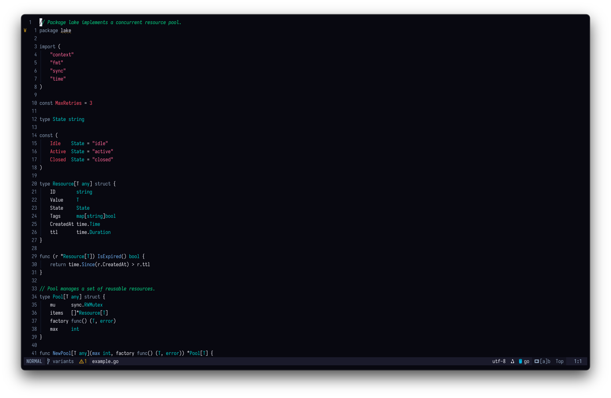
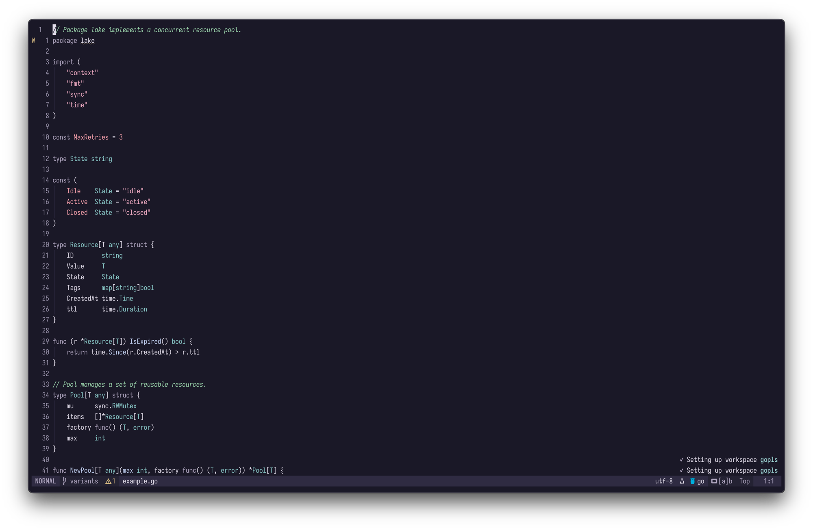

# lake-dweller.nvim

<p align="center">A minimal dark colorscheme that you can actually read at a glance.</p>

<p align="center"><strong>pond-dweller</strong><br>
</p>
<p align="center"><strong>lake-dweller</strong><br>
</p>
<p align="center"><strong>ocean-dweller</strong><br>
</p>

## Requirements

- Neovim >= 0.8.0
- `termguicolors` enabled
- [nvim-treesitter](https://github.com/nvim-treesitter/nvim-treesitter) (recommended for full syntax highlighting)

## Installation

### [lazy.nvim](https://github.com/folke/lazy.nvim)

```lua
{
    "yonatan-perel/lake-dweller.nvim",
    lazy = false,
    priority = 1000,
    config = function()
        require("lake-dweller").setup({
            variant = "lake-dweller", -- "lake-dweller", "pond-dweller", or "ocean-dweller"
        })
        vim.cmd.colorscheme("lake-dweller")
    end,
}
```

## Configuration

```lua
require("lake-dweller").setup({
    variant = "lake-dweller",  -- "lake-dweller", "pond-dweller", or "ocean-dweller"
    transparent = false,       -- enable transparent background
    italics = true,            -- enable italic text
    float_background = false,  -- distinct background for floating windows
})
```

## Extras

Additional theme files for other applications are in the `extras/` directory:

- **WezTerm**: `extras/wezterm/lake-dweller.toml`, `pond-dweller.toml`, `ocean-dweller.toml`

### Lualine

```lua
require("lualine").setup({
    options = {
        theme = require("lualine.themes.lake-dweller"),
    },
})
```

## Color Palette

<details>
<summary><strong>lake-dweller</strong></summary>

| Color | Hex | Usage |
|-------|-----|-------|
|  Dark Navy | `#0e0e16` | Background |
|  Light Grey | `#d8d8d8` | Base text |
|  Soft Green | `#8ac490` | Comments |
|  Muted Slate | `#858d95` | Keywords |
|  Pale Blue | `#b0c0e0` | Functions |
|  Muted Cyan | `#70a8a8` | Types |
|  Rosy Pink | `#d58ca6` | Strings |
|  Bright Red | `#ef8a90` | Constants, errors |

</details>

<details>
<summary><strong>pond-dweller</strong></summary>

| Color | Hex | Usage |
|-------|-----|-------|
|  Dusk Purple | `#1a1826` | Background |
|  Soft Lavender | `#e0dce8` | Base text |
|  Pastel Mint | `#a8d4b0` | Comments |
|  Faded Lilac | `#b0a8c0` | Keywords |
|  Light Periwinkle | `#c4d0ee` | Functions |
|  Soft Teal | `#98c8c8` | Types |
|  Blush Pink | `#e8b0c4` | Strings |
|  Soft Coral | `#f0a8b0` | Constants, errors |

</details>

<details>
<summary><strong>ocean-dweller</strong></summary>

| Color | Hex | Usage |
|-------|-----|-------|
|  Deep Abyss | `#080810` | Background |
|  Crisp White | `#e8e8f0` | Base text |
|  Vivid Green | `#60d890` | Comments |
|  Steel Blue | `#90a0b8` | Keywords |
|  Electric Blue | `#80b0f0` | Functions |
|  Bright Cyan | `#40c8c8` | Types |
|  Hot Pink | `#f07098` | Strings |
|  Vivid Red | `#ff6070` | Constants, errors |

</details>

## Supported Plugins

- [nvim-treesitter](https://github.com/nvim-treesitter/nvim-treesitter)
- [lualine.nvim](https://github.com/nvim-lualine/lualine.nvim)
- [nvim-cmp](https://github.com/hrsh7th/nvim-cmp)
- [Telescope](https://github.com/nvim-telescope/telescope.nvim)
- [fzf-lua](https://github.com/ibhagwan/fzf-lua)
- [Oil.nvim](https://github.com/stevearc/oil.nvim)
- [Trouble.nvim](https://github.com/folke/trouble.nvim)
- [which-key.nvim](https://github.com/folke/which-key.nvim)
- [Snacks.nvim](https://github.com/folke/snacks.nvim)
- [nvim-notify](https://github.com/rcarriga/nvim-notify)
- [gitsigns.nvim](https://github.com/lewis6991/gitsigns.nvim)
- [noice.nvim](https://github.com/folke/noice.nvim)
- [blink.cmp](https://github.com/Saghen/blink.cmp)
- [lazy.nvim](https://github.com/folke/lazy.nvim)
- [indent-blankline.nvim](https://github.com/lukas-reineke/indent-blankline.nvim)
- [mini.nvim](https://github.com/echasnovski/mini.nvim)
- [flash.nvim](https://github.com/folke/flash.nvim)
- [neo-tree.nvim](https://github.com/nvim-neo/neo-tree.nvim)

## Philosophy

This theme makes some opinionated decisions based on the following principles:

### You don't need a color for *everything*

Only use distinct colors for specific, common elements—so you can tell at a glance what you're looking at:
1. Functions
2. Types
3. Keywords
4. Constant values—numbers, booleans, strings, nulls, etc. Strings can use slightly different shades for clarity.
5. Comments

### Keywords don't need your attention

Keywords are the most repetitive part of code and therefore the easiest to read quickly—you don't really need them to stand out.

### Comments are important

You should not neglect your comments. They should pop out immediately, while being easy to distinguish from actual code.

## Inspiration

- [kanagawa.nvim](https://github.com/rebelot/kanagawa.nvim)
- [rose-pine](https://github.com/rose-pine/neovim)
- [alabaster.nvim](https://github.com/p00f/alabaster.nvim)

## License

MIT
